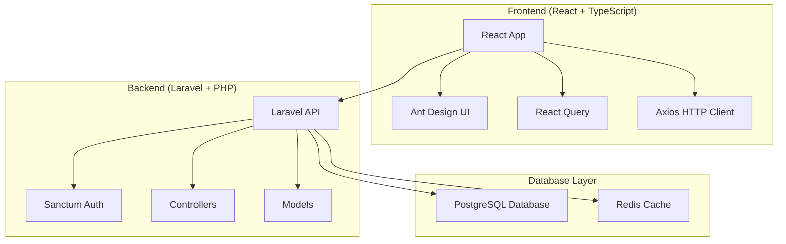

# 🎨 Implementação dos Diagramas de Arquitetura - ChainView

## ✅ **O que foi implementado:**

### 📊 **1. Documentação Completa da Arquitetura**
- **Arquivo**: `docs/architecture.md`
- **Conteúdo**: 5 diagramas Mermaid detalhados
- **Cobertura**: Arquitetura geral, fluxos, containers, CI/CD

### 🎯 **2. Diagramas Criados:**

#### **A. Arquitetura Geral**


#### **B. Fluxo de Autenticação**
- Sequência completa de login/logout
- Interação Frontend ↔ API ↔ Database
- Gerenciamento de tokens JWT

#### **C. Fluxo da Árvore de Processos**
- Carregamento hierárquico de dados
- Expansão de áreas e processos
- Interação com API REST

#### **D. Estrutura de Containers Docker**
- Organização dos serviços
- Mapeamento de portas
- Serviços disponíveis

#### **E. Pipeline CI/CD**
- Fluxo completo do GitHub Actions
- Jobs de teste, lint, segurança
- Processo de deploy

### 🔧 **3. Automação Implementada:**

#### **Script de Geração**
- **Arquivo**: `scripts/generate-diagrams.sh`
- **Funcionalidade**: Gera PNGs automaticamente
- **Comando**: `make diagrams`

#### **Integração com Makefile**
```bash
make diagrams    # Gerar diagramas PNG
make docs        # Gerar toda documentação
```

#### **Documentação de Uso**
- **Arquivo**: `docs/README.md`
- **Instruções**: Como usar e personalizar
- **Convenções**: Cores e estilos padronizados

### 📚 **4. Integração com README Principal**
- Seção dedicada aos diagramas
- Referência à documentação completa
- Instruções de instalação do Mermaid CLI

## 🎨 **Características dos Diagramas:**

### **Cores Padronizadas:**
- **Frontend**: Azul (#61dafb)
- **Backend**: Vermelho (#ff2d20)
- **Database**: Azul escuro (#336791)
- **Cache**: Vermelho (#dc382d)
- **Infraestrutura**: Verde (#009639)

### **Estilo Consistente:**
- Fundo transparente
- Labels claros
- Fluxo lógico
- Alta resolução

## 🚀 **Como Usar:**

### **1. Visualizar no GitHub:**
- Os diagramas Mermaid são renderizados automaticamente
- Visível em `docs/architecture.md`
- Integrado ao README principal

### **2. Gerar Imagens PNG:**
```bash
# Instalar Mermaid CLI
npm install -g @mermaid-js/mermaid-cli

# Gerar diagramas
make diagrams
```

### **3. Usar em Apresentações:**
- PNGs com fundo transparente
- Alta resolução para slides
- Cores consistentes

## 📋 **Checklist Completo:**

- [x] **Documentação da arquitetura** criada
- [x] **5 diagramas Mermaid** implementados
- [x] **Script de automação** desenvolvido
- [x] **Integração com Makefile** configurada
- [x] **README de documentação** criado
- [x] **Convenções de cores** definidas
- [x] **Instruções de uso** documentadas
- [x] **Integração com README principal** implementada

## 🎯 **Benefícios Alcançados:**

### **Para Desenvolvimento:**
- Visualização clara da arquitetura
- Entendimento dos fluxos de dados
- Facilita planejamento de novas funcionalidades

### **Para Apresentações:**
- Diagramas profissionais
- Cores consistentes
- Alta qualidade visual

### **Para Documentação:**
- Documentação sempre atualizada
- Diagramas sincronizados com código
- Fácil manutenção

## 🔮 **Próximos Passos Sugeridos:**

1. **Instalar Mermaid CLI** para gerar PNGs
2. **Executar `make diagrams`** para criar imagens
3. **Usar em apresentações** e documentação
4. **Manter atualizado** conforme evolução do projeto

---

**🎉 Implementação completa e profissional dos diagramas de arquitetura!** 🚀
