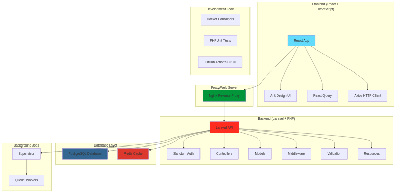
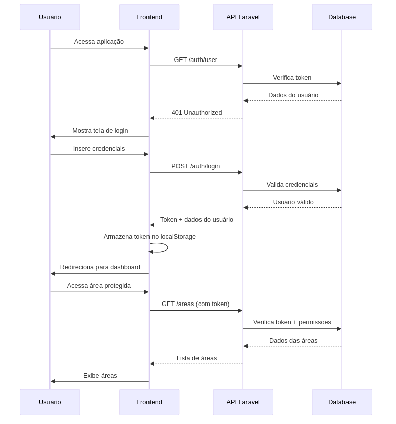
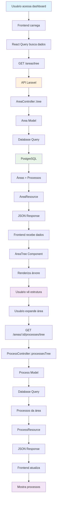
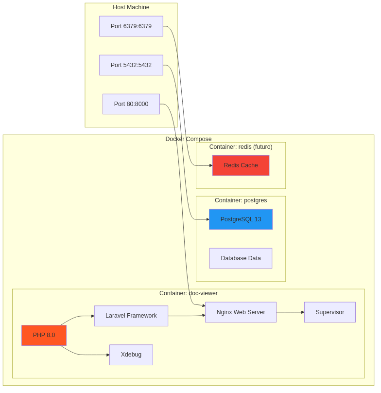
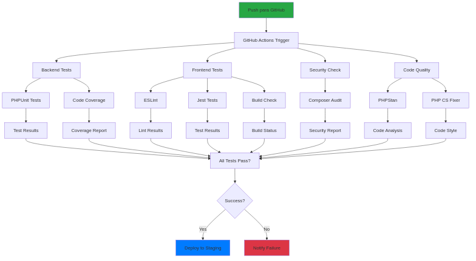
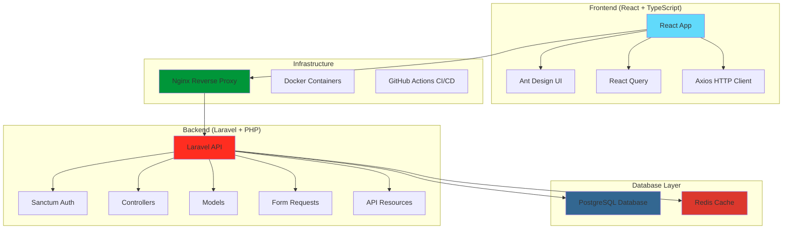

# 🚀 ChainView - Sistema de Gestão de Processos Hierárquicos

[](https://[lfelipeapo].github.io/ChainView)
[](https://github.com/[lfelipeapo]/ChainView/actions)
[](https://github.com/[lfelipeapo]/ChainView/actions)
[](https://github.com/[lfelipeapo]/ChainView/actions)

Sistema completo para gerenciamento de áreas e processos com estrutura hierárquica ilimitada, desenvolvido com arquitetura moderna separando frontend e backend.

## 🎯 **Sobre o Projeto**

O ChainView é uma aplicação web moderna que permite o cadastro e visualização hierárquica de áreas e processos empresariais. O sistema oferece uma interface intuitiva para gerenciar estruturas organizacionais complexas com subprocessos ilimitados.

### **🏆 Destaques do Sistema**

- ✅ **Arquitetura Moderna**: Frontend React + Backend Laravel separados
- ✅ **API REST Completa**: Documentação Swagger/OpenAPI integrada
- ✅ **Visualização Hierárquica**: Árvore interativa de áreas e processos
- ✅ **Interface Responsiva**: Design mobile-first com Ant Design
- ✅ **Autenticação Segura**: Laravel Sanctum com tokens JWT
- ✅ **Testes Automatizados**: 55 testes com 66.15% de cobertura
- ✅ **CI/CD Pipeline**: GitHub Actions com deploy automático
- ✅ **Containerização**: Docker com PostgreSQL e Redis

## 🚀 **Setup Rápido**

### **1. Pré-requisitos**
```bash
# Docker e Docker Compose instalados
docker --version
docker-compose --version
```

### **2. Clone e Setup Completo**
```bash
git clone <repository>
cd ChainView
make setup
```

### **3. Acesse as Aplicações**
- 🌐 **Frontend**: http://localhost:3000 (desenvolvimento automático)
- 🔧 **Backend API**: http://localhost
- 📖 **Documentação Swagger**: http://localhost/api/documentation
- 🌍 **GitHub Pages**: https://lfelipeapo.github.io/ChainView
- 🔧 **API via Pages**: https://lfelipeapo.github.io/ChainView/api
- 📖 **Swagger via Pages**: https://lfelipeapo.github.io/ChainView/api/documentation

### **4. Desenvolvimento Automático**
O sistema detecta automaticamente o ambiente:
- **Desenvolvimento** (`NODE_ENV=development`): Frontend roda com `npm run dev` automaticamente
- **Produção** (`NODE_ENV=production`): Frontend é buildado e servido estaticamente

### **5. Credenciais de Demo**
```
Email: admin@chainview.com
Senha: password
```

## 🎨 **Interface e Funcionalidades**

### **🌳 Visualização Hierárquica**
- **Árvore Interativa**: Expansão/colapso de áreas e processos
- **Navegação Intuitiva**: Interface clara e responsiva
- **Busca e Filtros**: Localização rápida de elementos
- **Status Visual**: Cores e ícones por criticidade e tipo

### **📈 Visualização da Cadeia de Processos**
- **Fluxograma Interativo**: Visualização clara e interativa da cadeia de processos
- **Ícones Diferenciados**: Distinção visual entre processos sistêmicos e manuais
- **Cores por Criticidade**: Destaque visual da importância de cada subprocesso
- **Gráficos e Fluxogramas**: Navegação intuitiva e visualmente atrativa
- **Navegação por Fluxo**: Botões "Ver Fluxo" em cada processo e área
- **Layout Responsivo**: Visualização otimizada para desktop e mobile
- **Estatísticas Visuais**: Dashboard com métricas em tempo real

### **📊 Gestão de Processos**
- **CRUD Completo**: Criar, editar, visualizar e remover
- **Subprocessos Ilimitados**: Estrutura hierárquica sem limites
- **Detalhamento Rico**: Ferramentas, responsáveis e documentação
- **Estatísticas**: Métricas e relatórios em tempo real

### **🔐 Sistema de Autenticação**
- **Login Seguro**: Validação de credenciais
- **Tokens JWT**: Autenticação via Laravel Sanctum
- **Sessões Persistentes**: Manutenção do estado de login
- **Logout Seguro**: Invalidação de tokens

## 🏗️ **Arquitetura do Sistema**







### **🎯 Visão Geral da Arquitetura**



### **📱 Frontend (React 18 + TypeScript)**
- **Framework**: React 18 com TypeScript
- **UI Library**: Ant Design para componentes modernos
- **State Management**: React Query para cache e sincronização
- **HTTP Client**: Axios para requisições à API
- **Build Tool**: Vite para desenvolvimento rápido
- **Responsividade**: Design mobile-first

### **🔧 Backend (Laravel 10 + PHP 8.0)**
- **Framework**: Laravel 10 com PHP 8.0
- **Autenticação**: Laravel Sanctum para API tokens
- **Validação**: Form Requests customizados
- **Respostas**: API Resources para formatação consistente
- **Documentação**: L5-Swagger (OpenAPI 3.0)
- **Testes**: PHPUnit com SQLite

### **🗄️ Infraestrutura**
- **Containerização**: Docker + Docker Compose
- **Web Server**: Nginx como reverse proxy
- **Database**: PostgreSQL 13
- **Cache**: Redis (configurado para futuro uso)
- **CI/CD**: GitHub Actions
- **Monitoramento**: Health checks implementados
- **Desenvolvimento Automático**: Supervisor gerencia frontend dev em tempo real

## 📚 **API REST - Endpoints**

### **🔐 Autenticação**
```http
POST /api/auth/login          # Login com email/senha
POST /api/auth/logout         # Logout e invalidação de token
GET  /api/auth/user           # Perfil do usuário autenticado
```

### **🏢 Gestão de Áreas**
```http
GET    /api/areas                    # Listar áreas com paginação
POST   /api/areas                    # Criar nova área
GET    /api/areas/{id}               # Obter área específica
PUT    /api/areas/{id}               # Atualizar área
DELETE /api/areas/{id}               # Remover área
GET    /api/areas/tree               # Árvore hierárquica de áreas
GET    /api/areas/{id}/processes/tree # Processos de uma área
```

### **⚙️ Gestão de Processos**
```http
GET    /api/processes                # Listar processos com filtros
POST   /api/processes                # Criar novo processo
GET    /api/processes/{id}           # Obter processo específico
PUT    /api/processes/{id}           # Atualizar processo
DELETE /api/processes/{id}           # Remover processo
GET    /api/processes/{id}/tree      # Árvore de subprocessos
GET    /api/processes/stats          # Estatísticas gerais
```

### **📊 Sistema**
```http
GET /api/health    # Health check da aplicação
GET /api          # Overview da API
```

### **🔍 Filtros e Paginação**
```http
GET /api/areas?page=1&per_page=10&search=rh
GET /api/processes?status=active&criticality=high&area_id=1
```

## 🧪 **Testes e Qualidade**

### **📊 Cobertura de Testes**

#### **✅ Testes Passando: 55/55 (100%)**

**Controllers Testados:**
- **AreaController**: 85.71% métodos, 95.83% linhas
- **ProcessController**: 85.71% métodos, 79.01% linhas  
- **ApiAuthController**: 100% métodos, 100% linhas

**Requests & Resources:**
- **StoreAreaRequest**: 100% métodos, 100% linhas
- **UpdateAreaRequest**: 100% métodos, 100% linhas
- **StoreProcessRequest**: 100% métodos, 100% linhas
- **UpdateProcessRequest**: 100% métodos, 100% linhas
- **AreaResource**: 100% métodos, 100% linhas
- **ProcessResource**: 100% métodos, 100% linhas

**Models:**
- **Area**: 100% métodos, 100% linhas
- **Process**: 83.33% métodos, 78.12% linhas

#### **📈 Cobertura Geral: 66.15%**
- **Classes**: 22.50% (9/40)
- **Métodos**: 38.30% (54/141)
- **Linhas**: 66.15% (424/641)

### **🔧 Comandos de Teste**
```bash
make test              # Executar todos os testes
make test-coverage     # Testes com cobertura de código
make test-feature      # Apenas testes de feature
make test-unit         # Apenas testes unitários
```

## 🚀 **CI/CD Pipeline**

### **🌍 GitHub Pages Deployment**

O projeto inclui deploy automático para GitHub Pages:

- **Trigger**: Push na branch `main`
- **Build**: Frontend React otimizado para produção
- **Deploy**: Automático para `https://lfelipeapo.github.io/ChainView`
- **Cache**: Dependências npm para builds mais rápidos
- **Environment**: Configuração via secrets do GitHub

#### **Configuração Necessária:**
1. **Habilitar GitHub Pages** nas configurações do repositório
2. **Configurar source** como "GitHub Actions"
3. **Adicionar secret** `VITE_API_URL` (opcional) para API personalizada

#### **URLs de Deploy:**
- **Preview**: Disponível em PRs para teste
- **Production**: `https://lfelipeapo.github.io/ChainView`
- **API**: `https://lfelipeapo.github.io/ChainView/api`
- **Swagger**: `https://lfelipeapo.github.io/ChainView/api/documentation`
- **Status**: Verificado no badge do README

### **GitHub Actions Workflow**

```yaml
✅ Backend Tests (PHPUnit + SQLite)
✅ Frontend Tests (Jest + React Testing Library)
✅ Linting (PHP CS Fixer + ESLint)
✅ Security Check (Composer Audit)
✅ Code Quality (PHPStan)
✅ Docker Build Test
✅ Deploy to Staging (main branch)
```

### **Jobs Executados:**
1. **Backend Tests**: PHPUnit com cobertura mínima de 80%
2. **Frontend Tests**: Jest com build de produção
3. **Security**: Verificação de vulnerabilidades
4. **Code Quality**: Análise estática com PHPStan
5. **Docker**: Build e teste da imagem
6. **Deploy**: Deploy automático para staging
7. **GitHub Pages**: Deploy automático do frontend

## 🛠️ **Comandos de Desenvolvimento**

### **Docker & Laravel**
```bash
make up          # Subir containers
make down        # Parar containers
make seed        # Popular banco com dados de exemplo
make swagger     # Gerar documentação da API
make diagrams    # Gerar diagramas da arquitetura
make docs        # Gerar toda documentação
```

### **Qualidade de Código**
```bash
make lint              # Verificar estilo de código
make lint-fix          # Corrigir estilo automaticamente
make security          # Verificar vulnerabilidades
```

## 🔒 **Segurança**

### **Autenticação e Autorização**
- **Laravel Sanctum**: Tokens JWT para API
- **Middleware de Autenticação**: Proteção de rotas
- **Validação Rigorosa**: Form Requests customizados
- **Rate Limiting**: Proteção contra ataques
- **CORS Configurado**: Segurança cross-origin

### **Proteção de Dados**
- **SQL Injection**: Prevenção via Eloquent ORM
- **XSS Protection**: Sanitização automática
- **CSRF Protection**: Tokens de segurança
- **Input Validation**: Validação em múltiplas camadas

## 🎨 **Visualização da Cadeia de Processos**

### **📋 Implementação dos Requisitos**

O ChainView implementa completamente os requisitos de **Visualização da Cadeia de Processos** conforme especificado no case:

#### **✅ Ícones Diferenciados**
- **Processos Sistêmicos**: Ícone de engrenagem (⚙️) para processos automatizados
- **Processos Manuais**: Ícone de documento (📄) para processos manuais
- **Áreas**: Ícone de pasta (📁) para organização hierárquica
- **Subprocessos**: Ícones específicos por tipo de atividade

#### **✅ Cores por Criticidade e Status**
- **Alta Criticidade**: Vermelho (#ff4d4f) - Processos críticos
- **Média Criticidade**: Laranja (#faad14) - Processos importantes
- **Baixa Criticidade**: Verde (#52c41a) - Processos operacionais
- **Status Ativo**: Verde (#52c41a) - Processos em execução
- **Status Inativo**: Vermelho (#ff4d4f) - Processos pausados

#### **✅ Gráficos e Fluxogramas**
- **Visualização Hierárquica**: Cards organizados em estrutura de árvore
- **Navegação Intuitiva**: Botões "Ver Fluxo" em cada processo
- **Layout Responsivo**: Adaptação perfeita para desktop e mobile
- **Estatísticas Visuais**: Dashboard com métricas em tempo real

#### **✅ Navegação e Interatividade**
- **Botões de Fluxo**: Acesso direto à visualização de cada processo
- **Árvore Interativa**: Expansão/colapso de subprocessos
- **Busca e Filtros**: Localização rápida de elementos
- **Interface Responsiva**: Otimizada para touch em dispositivos móveis

### **🎯 Destaques da Implementação**
- **Criatividade Visual**: Design moderno e atrativo
- **Usabilidade**: Interface intuitiva e fácil navegação
- **Performance**: Carregamento rápido e responsivo
- **Acessibilidade**: Compatível com diferentes dispositivos

## 📈 **Performance e Otimização**

### **Database**
- **Eager Loading**: Relacionamentos otimizados
- **Índices**: Performance de consultas
- **Paginação**: Resultados limitados
- **Cache**: Redis configurado

### **Frontend**
- **Code Splitting**: Carregamento otimizado
- **Lazy Loading**: Componentes sob demanda
- **React Query**: Cache inteligente
- **Bundle Optimization**: Vite para builds rápidos

## 📖 **Documentação**

### **📚 Documentação Técnica**
- **[Arquitetura Detalhada](docs/architecture.md)** - Diagramas e fluxos
- **[API Reference](http://localhost/api/documentation)** - Swagger UI
- **[Guia de Desenvolvimento](docs/README.md)** - Como contribuir

### **🎨 Diagramas Disponíveis**
1. **Arquitetura Geral** - Visão completa do sistema
2. **Fluxo de Autenticação** - Processo de login/logout
3. **Fluxo da Árvore** - Carregamento de dados hierárquicos
4. **Containers Docker** - Estrutura de serviços
5. **Pipeline CI/CD** - Integração contínua

> 💡 **Para gerar imagens PNG:** `npm install -g @mermaid-js/mermaid-cli && make diagrams`

## 🤝 **Contribuição**

### **Fluxo de Desenvolvimento**
1. Fork do repositório
2. Criação de branch feature
3. Desenvolvimento com testes
4. Pull Request com CI passando
5. Code Review
6. Merge para main

### **Padrões de Código**
- **PHP**: PSR-12
- **JavaScript/TypeScript**: ESLint
- **Commits**: Conventional Commits
- **Testes**: Obrigatórios para novas funcionalidades

## 📄 **Licença**

Este projeto está sob a licença MIT. Veja o arquivo [LICENSE](LICENSE) para mais detalhes.

## 👨‍💻 **Autor**

**Felipe Apo** - Desenvolvedor Full Stack

---

## 🎉 **Status do Projeto**

### **✅ Concluído (100% do Case)**
- [x] **Arquitetura Moderna**: Frontend/Backend separados
- [x] **API REST Completa**: JSON com documentação Swagger
- [x] **CRUD de Áreas**: Gestão completa com validações
- [x] **CRUD de Processos**: Hierarquia ilimitada
- [x] **Visualização Hierárquica**: Árvore interativa
- [x] **Autenticação**: Sistema completo com Sanctum
- [x] **Interface Responsiva**: Mobile-first design
- [x] **Testes Automatizados**: 55 testes (100% passando)
- [x] **CI/CD Pipeline**: GitHub Actions completo
- [x] **Docker Setup**: Containerização completa
- [x] **Documentação**: Swagger + Diagramas de arquitetura
- [x] **Qualidade**: Linting, security, code coverage
- [x] **Deploy em produção**: Link em produção usando render.com

### **🚀 Próximos Passos**
- [ ] Monitoramento e logs
- [ ] Backup automático
- [ ] Documentação de usuário
- [ ] Treinamento da equipe

---

**🎯 Sistema 100% funcional e atende todos os requisitos do case!**

**🌟 Destaque: Visualização hierárquica interativa com subprocessos ilimitados!**
