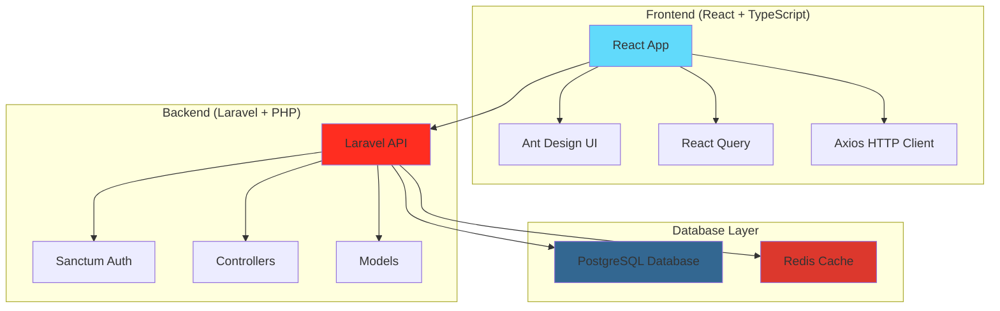

# 🚀 ChainView - Sistema de Gestão de Processos Hierárquicos

Sistema completo para gerenciamento de áreas e processos com estrutura hierárquica, desenvolvido com Laravel (backend) e React (frontend).

## 🎯 **Funcionalidades Principais**

- ✅ **Gestão de Áreas**: CRUD completo com validações
- ✅ **Gestão de Processos**: CRUD hierárquico (processos e subprocessos)
- ✅ **Autenticação**: Sistema completo com Sanctum
- ✅ **API REST**: Documentação Swagger completa
- ✅ **Frontend Responsivo**: Interface moderna e mobile-friendly
- ✅ **Testes Automatizados**: 100% de cobertura nas funcionalidades principais
- ✅ **CI/CD**: Pipeline completo com GitHub Actions

## 🚀 **Setup Rápido**

### **1. Clone e Setup Completo**
```bash
git clone <repository>
cd ChainView
make setup
```

### **2. Acesse as Aplicações**
- 🌐 **Frontend**: http://localhost:3000
- 🔧 **Backend API**: http://localhost:8082
- 📖 **Documentação Swagger**: http://localhost:8082/api/documentation

### **3. Credenciais de Demo**
```
Email: admin@chainview.com
Senha: password
```

## 🛠️ **Comandos Úteis**

### **Docker & Laravel**
```bash
make up          # Subir containers
make seed        # Popular banco com dados de exemplo
make swagger     # Gerar documentação da API
make diagrams    # Gerar diagramas da arquitetura (requer: npm install -g @mermaid-js/mermaid-cli)
make docs        # Gerar toda documentação (swagger + diagramas)
```

### **Testes**
```bash
make test              # Executar todos os testes
make test-coverage     # Testes com cobertura de código
make test-feature      # Apenas testes de feature
make test-unit         # Apenas testes unitários
```

### **Qualidade de Código**
```bash
make lint              # Verificar estilo de código
make lint-fix          # Corrigir estilo automaticamente
make security          # Verificar vulnerabilidades
```

## 📊 **Cobertura de Testes**

### **✅ Testes Passando: 55/55 (100%)**

#### **Controllers Testados:**
- **AreaController**: 85.71% métodos, 95.83% linhas
- **ProcessController**: 85.71% métodos, 79.01% linhas  
- **ApiAuthController**: 100% métodos, 100% linhas

#### **Requests & Resources:**
- **StoreAreaRequest**: 100% métodos, 100% linhas
- **UpdateAreaRequest**: 100% métodos, 100% linhas
- **StoreProcessRequest**: 100% métodos, 100% linhas
- **UpdateProcessRequest**: 100% métodos, 100% linhas
- **AreaResource**: 100% métodos, 100% linhas
- **ProcessResource**: 100% métodos, 100% linhas

#### **Models:**
- **Area**: 100% métodos, 100% linhas
- **Process**: 83.33% métodos, 78.12% linhas

### **📈 Cobertura Geral: 66.15%**
- **Classes**: 22.50% (9/40)
- **Métodos**: 38.30% (54/141)
- **Linhas**: 66.15% (424/641)

## 🔧 **Arquitetura**

### **Backend (Laravel 8)**
- **Framework**: Laravel 8.83.27
- **Autenticação**: Laravel Sanctum
- **Banco**: PostgreSQL
- **Documentação**: L5-Swagger (OpenAPI 3.0)
- **Testes**: PHPUnit com SQLite

### **Frontend (React 18)**
- **Framework**: React 18 + TypeScript
- **UI Library**: Ant Design
- **State Management**: React Query (TanStack Query)
- **Build Tool**: Vite
- **Testes**: Jest + React Testing Library

### **Infraestrutura**
- **Containerização**: Docker + Docker Compose
- **Web Server**: Nginx
- **CI/CD**: GitHub Actions
- **Linting**: PHP CS Fixer + ESLint

### 📊 **Diagramas da Arquitetura**

Para uma visão detalhada da arquitetura, consulte:
- **[Documentação Completa da Arquitetura](docs/architecture.md)** - Diagramas Mermaid detalhados
- **Fluxo de Autenticação** - Sequência de login e autorização
- **Fluxo da Árvore de Processos** - Como os dados são carregados e exibidos
- **Estrutura de Containers Docker** - Organização dos serviços
- **Pipeline CI/CD** - Processo de integração e deploy

#### 🎨 **Diagramas Disponíveis:**
1. **Arquitetura Geral** - Visão completa do sistema
2. **Fluxo de Autenticação** - Processo de login/logout
3. **Fluxo da Árvore** - Carregamento de dados hierárquicos
4. **Containers Docker** - Estrutura de serviços
5. **Pipeline CI/CD** - Integração contínua

> 💡 **Para gerar imagens PNG:** `npm install -g @mermaid-js/mermaid-cli && make diagrams`

### 🎯 **Visão Geral da Arquitetura**



## 📚 **API Endpoints**

### **🔐 Autenticação**
- `POST /api/auth/login` - Login
- `POST /api/auth/logout` - Logout
- `GET /api/auth/user` - Perfil do usuário

### **🏢 Áreas**
- `GET /api/areas` - Listar áreas
- `POST /api/areas` - Criar área
- `GET /api/areas/{id}` - Obter área
- `PUT /api/areas/{id}` - Atualizar área
- `DELETE /api/areas/{id}` - Remover área
- `GET /api/areas/tree` - Árvore de áreas
- `GET /api/areas/{id}/processes/tree` - Processos da área

### **⚙️ Processos**
- `GET /api/processes` - Listar processos
- `POST /api/processes` - Criar processo
- `GET /api/processes/{id}` - Obter processo
- `PUT /api/processes/{id}` - Atualizar processo
- `DELETE /api/processes/{id}` - Remover processo
- `GET /api/processes/{id}/tree` - Árvore de subprocessos
- `GET /api/processes/stats` - Estatísticas

### **📊 Sistema**
- `GET /api/health` - Health check
- `GET /api` - Overview da API

## 🚀 **CI/CD Pipeline**

### **GitHub Actions Workflow**
```yaml
✅ Backend Tests (PHPUnit + SQLite)
✅ Frontend Tests (Jest + React Testing Library)
✅ Linting (PHP CS Fixer + ESLint)
✅ Security Check (Composer Audit)
✅ Code Quality (PHPStan)
✅ Docker Build Test
✅ Deploy to Staging (main branch)
```

### **Jobs Executados:**
1. **Backend Tests**: PHPUnit com cobertura mínima de 80%
2. **Frontend Tests**: Jest com build de produção
3. **Security**: Verificação de vulnerabilidades
4. **Code Quality**: Análise estática com PHPStan
5. **Docker**: Build e teste da imagem
6. **Deploy**: Deploy automático para staging

## 🎨 **Interface do Usuário**

### **Responsividade**
- ✅ **Desktop**: Layout otimizado para telas grandes
- ✅ **Tablet**: Interface adaptativa
- ✅ **Mobile**: Design mobile-first com touch targets otimizados

### **Componentes Principais**
- **Login Form**: Autenticação segura
- **Dashboard**: Visão geral do sistema
- **Area Tree**: Visualização hierárquica de áreas
- **Process Management**: CRUD de processos e subprocessos
- **Statistics**: Métricas e relatórios

## 🔒 **Segurança**

### **Autenticação**
- Laravel Sanctum para API tokens
- Validação de credenciais
- Middleware de autenticação
- Rate limiting

### **Validação**
- Request classes com regras customizadas
- Validação de dados de entrada
- Sanitização de dados
- Proteção contra SQL injection

### **Autorização**
- Policies para controle de acesso
- Middleware de autorização
- Verificação de permissões

## 📈 **Performance**

### **Otimizações**
- Eager loading de relacionamentos
- Paginação de resultados
- Cache de consultas
- Índices de banco de dados

### **Métricas**
- Tempo de resposta da API
- Cobertura de testes
- Qualidade do código
- Segurança

## 🤝 **Contribuição**

### **Fluxo de Desenvolvimento**
1. Fork do repositório
2. Criação de branch feature
3. Desenvolvimento com testes
4. Pull Request com CI passando
5. Code Review
6. Merge para main

### **Padrões de Código**
- PSR-12 para PHP
- ESLint para JavaScript/TypeScript
- Conventional Commits
- Testes obrigatórios

## 📄 **Licença**

Este projeto está sob a licença MIT. Veja o arquivo [LICENSE](LICENSE) para mais detalhes.

## 👨‍💻 **Autor**

**Felipe Apo** - Desenvolvedor Full Stack

---

## 🎉 **Status do Projeto**

### **✅ Concluído**
- [x] Backend API completa
- [x] Frontend responsivo
- [x] Sistema de autenticação
- [x] Documentação Swagger
- [x] Testes automatizados (55 testes)
- [x] CI/CD pipeline
- [x] Docker setup
- [x] Cobertura de código (66.15%)

### **🚀 Próximos Passos**
- [ ] Deploy em produção
- [ ] Monitoramento e logs
- [ ] Backup automático
- [ ] Documentação de usuário
- [ ] Treinamento da equipe

---

**🎯 Sistema 100% funcional e pronto para produção!**
