# Arquitetura do ChainView

## Visão Geral da Arquitetura

O ChainView é uma aplicação web moderna construída com uma arquitetura de microserviços, utilizando tecnologias atuais e boas práticas de desenvolvimento.

## Diagrama da Arquitetura

### Arquitetura Geral


### Fluxo de Autenticação

```mermaid
sequenceDiagram
    participant U as Usuário
    participant F as Frontend
    participant A as API Laravel
    participant D as Database
    
    U->>F: Acessa aplicação
    F->>A: GET /auth/user
    A->>D: Verifica token
    D-->>A: Dados do usuário
    A-->>F: 401 Unauthorized
    F->>U: Mostra tela de login
    
    U->>F: Insere credenciais
    F->>A: POST /auth/login
    A->>D: Valida credenciais
    D-->>A: Usuário válido
    A-->>F: Token + dados do usuário
    F->>F: Armazena token no localStorage
    F->>U: Redireciona para dashboard
    
    U->>F: Acessa área protegida
    F->>A: GET /areas (com token)
    A->>D: Verifica token + permissões
    D-->>A: Dados das áreas
    A-->>F: Lista de áreas
    F->>U: Exibe áreas
```



### Fluxo da Árvore de Processos

```mermaid
flowchart TD
    A[Usuário acessa dashboard] --> B[Frontend carrega]
    B --> C[React Query busca dados]
    C --> D[GET /areas/tree]
    D --> E[API Laravel]
    E --> F[AreaController@tree]
    F --> G[Area Model]
    G --> H[Database Query]
    H --> I[PostgreSQL]
    I --> J[Áreas + Processos]
    J --> K[AreaResource]
    K --> L[JSON Response]
    L --> M[Frontend recebe dados]
    M --> N[AreaTree Component]
    N --> O[Renderiza árvore]
    O --> P[Usuário vê estrutura]
    
    P --> Q[Usuário expande área]
    Q --> R[GET /areas/{id}/processes/tree]
    R --> S[ProcessController@processesTree]
    S --> T[Process Model]
    T --> U[Database Query]
    U --> V[Processos da área]
    V --> W[ProcessResource]
    W --> X[JSON Response]
    X --> Y[Frontend atualiza]
    Y --> Z[Mostra processos]
    
    style A fill:#e1f5fe
    style E fill:#fff3e0
    style I fill:#e8f5e8
    style P fill:#f3e5f5
    style Z fill:#f3e5f5
```

### Estrutura de Containers Docker


### Pipeline CI/CD


## Componentes Principais

### Frontend
- **React 18** com TypeScript
- **Ant Design** para componentes UI
- **React Query** para gerenciamento de estado
- **Axios** para requisições HTTP
- **Responsive Design** para mobile/desktop

### Backend
- **Laravel 10** com PHP 8.0
- **Laravel Sanctum** para autenticação
- **PostgreSQL** como banco principal
- **Redis** para cache (futuro)
- **Supervisor** para jobs em background

### Infraestrutura
- **Docker** para containerização
- **Nginx** como reverse proxy
- **GitHub Actions** para CI/CD
- **PHPUnit** para testes
- **Xdebug** para cobertura de código

## Padrões de Design

### API RESTful
- Endpoints padronizados
- Respostas JSON consistentes
- Códigos de status HTTP apropriados
- Validação de entrada
- Tratamento de erros

### Autenticação
- Tokens JWT via Sanctum
- Middleware de autenticação
- Refresh tokens automáticos
- Logout seguro

### Testes
- Testes de Feature (54 testes)
- Testes Unitários (1 teste)
- Cobertura de código (66.15%)
- Testes automatizados via CI/CD

## Segurança

- **CORS** configurado
- **CSRF** protection
- **SQL Injection** prevention
- **XSS** protection
- **Rate Limiting** (futuro)
- **Input Validation** rigorosa

## Performance

- **Database Indexing** otimizado
- **Query Optimization** implementada
- **Caching Strategy** planejada
- **Lazy Loading** no frontend
- **Code Splitting** React

## Monitoramento

- **Logs** estruturados
- **Error Tracking** (futuro)
- **Performance Monitoring** (futuro)
- **Health Checks** implementados
